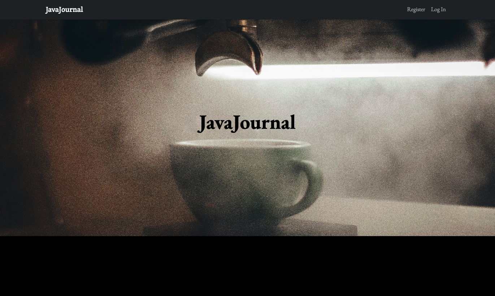
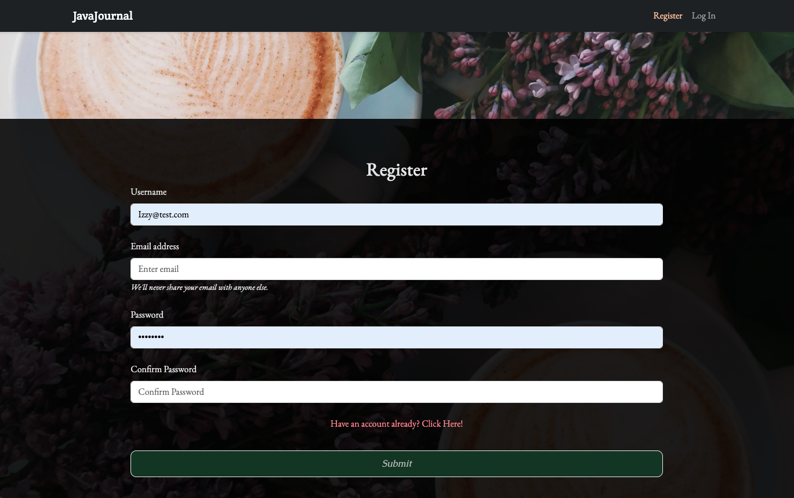
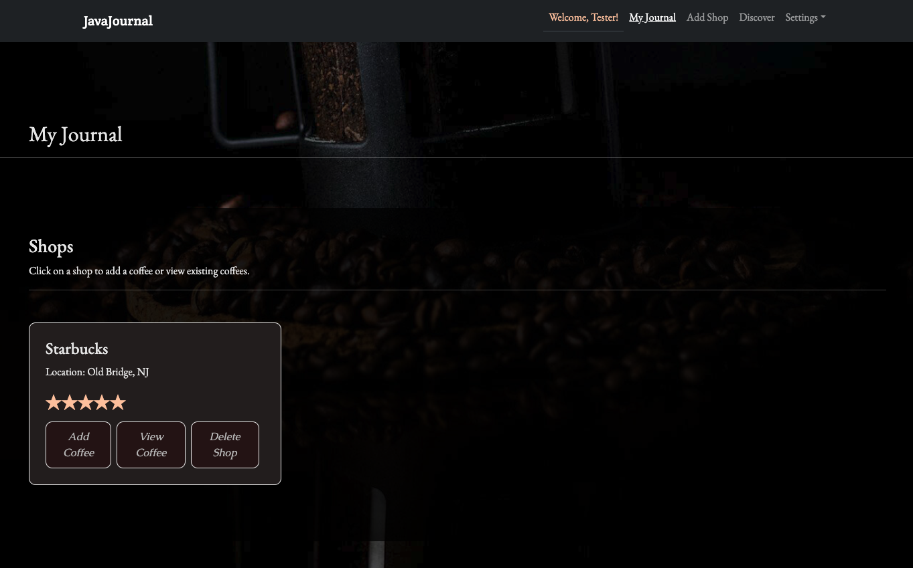
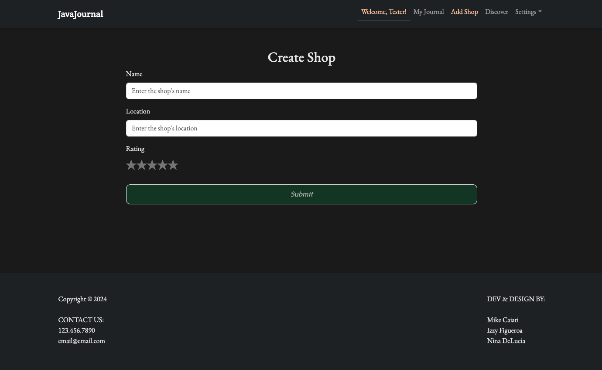
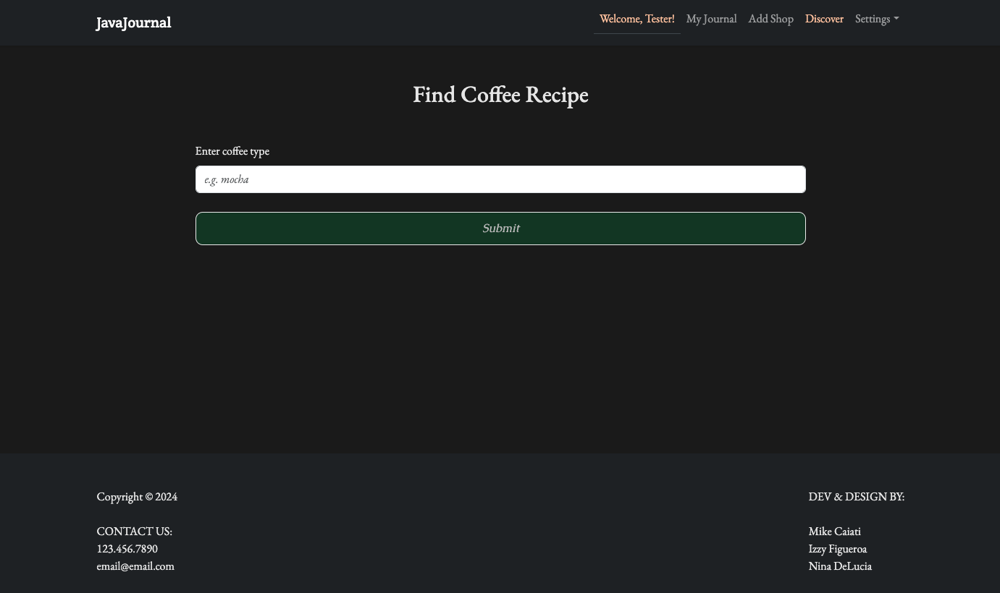
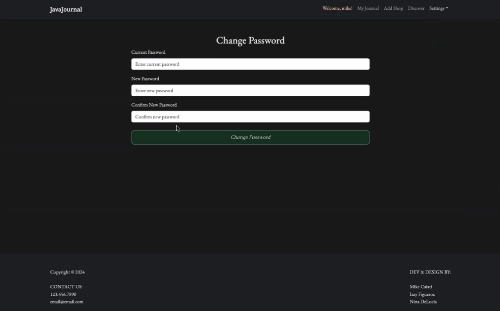

# JavaJournal

JavaJournal is a web application designed to help users manage and rate their favorite coffee shops and find new coffee recipes to try. The application is built using React, TypeScript, and Vite on the client side, and Express with Apollo Server on the server side. It also includes end-to-end testing with Cypress.

## Table of Contents

- [Features](#features)
- [Installation](#installation)
- [Usage](#usage)
- [Scripts](#scripts)
- [API Endpoints](#api-endpoints)
- [Testing](#testing)
- [Collaborators](#contributing)
- [License](#license)

## Features

- User authentication and authorization
- Add, view, and delete coffee shops
- Rate coffee shops
- Add and view coffee recipes
- Responsive design
- End-to-end testing with Cypress

## Installation

1. Clone the repository:

```sh
git clone https://github.com/yourusername/javajournal.git
cd javajournal
```

2. Install dependencies for both client and server:

```sh
npm run install
```

3. Create a `.env` file in the `server` directory and add your environment variables:

PORT=3333
VITE_RAPIDAPI_KEY=your_rapidapi_key
MONGODB_URL=your_mongodb_url 
JWT_SECRET=your_jwt_secret

## Usage

1. Start the development server:

```sh
npm run dev
```

2. Open your browser and navigate to `http://localhost:5173` to view the application.

This is what users will see when view our application in the browser<br>
<br><br>

Users will have the options to either Login or Register an account<br>
<br><br>

When a user is created, they will be redirected to our "My Journal" page that has all of their stored fields <br>
<br><br>

Users will will be able to add a visited shop and enter coffees that they had had. This will store all logged coffees so users can refer to drinks and their reviews.<br>
<br><br>

Users will be able to access our API to search for recipes to their favorite coffees<br>
<br><br>

Users will have the option to change their passwords in our setting tab<br>
<br><br>

## Scripts

- `client:install`: Install client dependencies
- `client:dev`: Start the client development server
- `client:build`: Build the client for production
- `server:install`: Install server dependencies
- `server:dev`: Start the server development server
- `server:build`: Build the server for production
- `build`: Build both client and server
- `dev`: Start both client and server in development mode
- `start`: Start the production server
- `cypress:open`: Open Cypress for end-to-end testing
- `cypress:run`: Run Cypress tests

## API Endpoints

- `GET /api/get-api-key`: Retrieve the API key
- `POST /graphql`: GraphQL endpoint for querying and mutating data

## Testing

JavaJournal uses Cypress for end-to-end testing. To run the tests, use the following command:

```sh
npm run cypress:open
```

## Collaborators
- [Mike Caiati](https://github.com/mcaiati2)
- [Nina DeLucia](https://github.com/delucianina)
- [Izzy Figueroa](https://github.com/IzzyFigueroa)

## Links
Github Repo:
Render:


## License

This project is licensed under the MIT License.