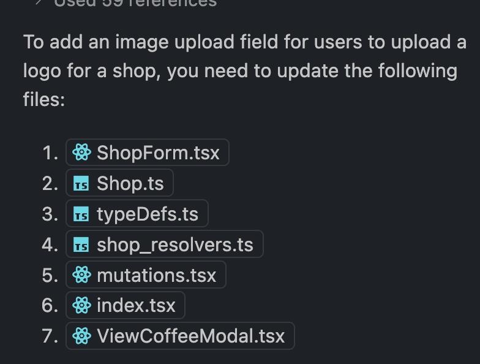

# Project 3 Info:

## Updated:
AuthForm.tsx

## Commands
  * npm run build (at top level) to rebuild client/server and start dev server
  * dep 'insert commit message here' origin HEAD:main

## App Names:
  * JavaJournal
  * Cool Beans
  * Sip Society

## Conversion
  **Shop = Pet**
  **Coffee = Post**
  **Age = Rating**
  **Type = Location**

## To-Do
  * Adjust testing files
  * Rating conversion to float
  * Match optional with not optional in the typedefs/resolvers/queries/mutations/etc
  * Move Coffee interface to new file

## Features Ideas/Backlog
  * Drop-down selection for flavor notes
  * Star rating instead of field (coffee cup empty vs full)
  * Google API Location Field
  * Retype password for validation creation
  * Prevent duplicate shops
  * Auto capitalize inputs for consistency
  * Option to add logo for shop
  * ? Shop Image Logo (also add to Modal) - Coffee Object / Shop Object ?
  
  * Brew methods (click into a picture to see info) 
  * French press calculator (api?)

# Data We're Capturing
  * User Model
    * Username
    * Email
    * Password

  * Shop Model
   * Name
   * Rating
   * Location (api or field)
   * Associated Coffees

  * Coffee Model
    * Name
    * Flavor
    * Associated Shop
    * Comments
    * Photo Upload

## Log
11/26
App working
Coffee Model complete (Coffee.ts)
Changed db

11/27
Mutations.ts completed
Context.d.ts not changed 
interfaces > index.d.ts

## Debugging:

## Copilot Prompt:
"without changing any of my code, can you please add comments to each line explaining in great detail what that line is doing? please include comments for imports and exports. please write the comments to help a beginner programmer understand the code"

## Sample API Response:

_id
name
image
description
recipeYield
datePublished
prepTime ?
totalTime ?
recipeIngredient
category

  {
    "_id": "6681b8d94507f78afe80183b",
    "@context": "https://schema.org",
    "@type": "Recipe",
    "name": "Caffè Mocha",
    "image": "https://athome.starbucks.com/sites/default/files/2021-06/1_CAH_CaffeMocha_Hdr_2880x16602.jpg",
    "description": "This Starbucks classic combines espresso, bittersweet mocha sauce and steamed milk for a sweetly satisfying coffee. Top it off with whipped cream and chocolate shavings for a delicious mug of coffee ready to be enjoyed any time at home.",
    "recipeYield": "1 serving",
    "datePublished": "Wed, 06/02/2021 - 13:58",
    "prepTime": "PT7M",
    "totalTime": "PT7M",
    "recipeIngredient": [
      "1 oz Starbucks® Espresso Roast ground coffee or",
      "1 cup milk of your choice",
      "3 Tbsp mocha sauce",
      "",
      ""
    ],
    "recipeInstructions": [
      {
        "@type": "HowToStep",
        "name": "01",
        "text": "Prepare 1 shot of espresso and pour into a mug.",
        "image": ""
      },
      {
        "@type": "HowToStep",
        "name": "02",
        "text": "Froth your milk using your preferred method. For more information on how to froth your milk, see our frothing guide here.",
        "image": ""
      },
      {
        "@type": "HowToStep",
        "name": "03",
        "text": "Add mocha sauce into your mug and gently stir into the coffee.",
        "image": ""
      },
      {
        "@type": "HowToStep",
        "name": "04",
        "text": "Gently pour your frothed milk into your mug until it’s almost full.",
        "image": ""
      }
    ],
    "category": "HOT BEVERAGES"
  },
  